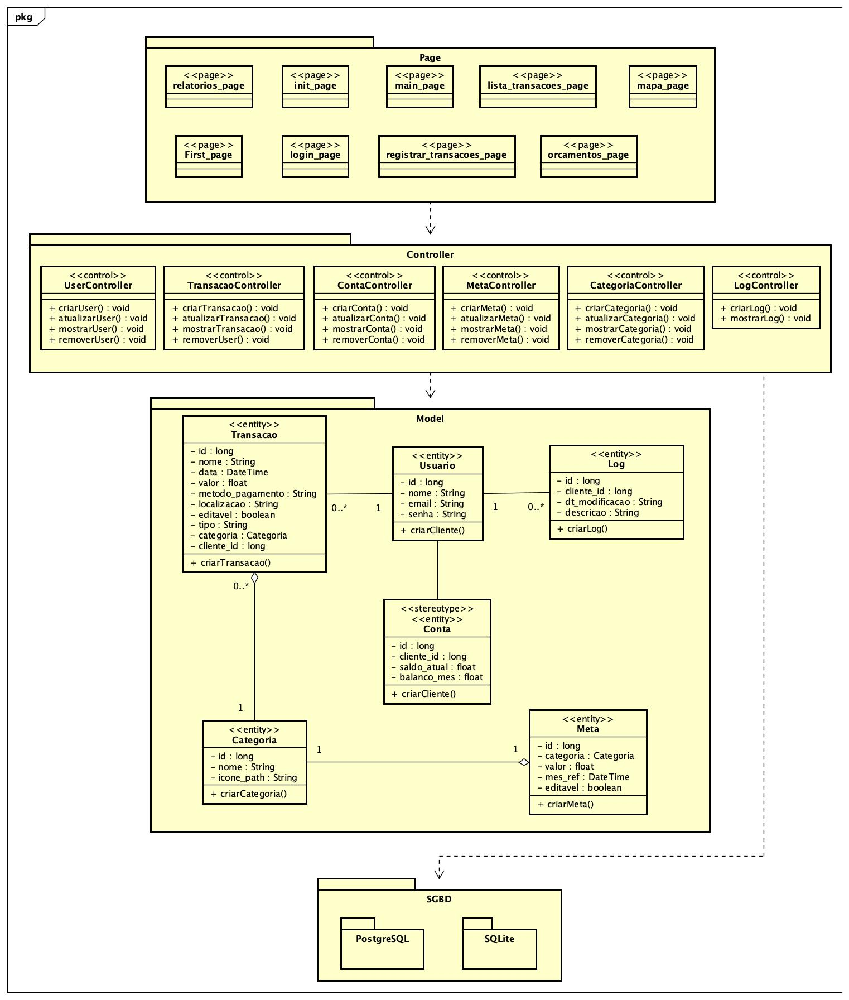
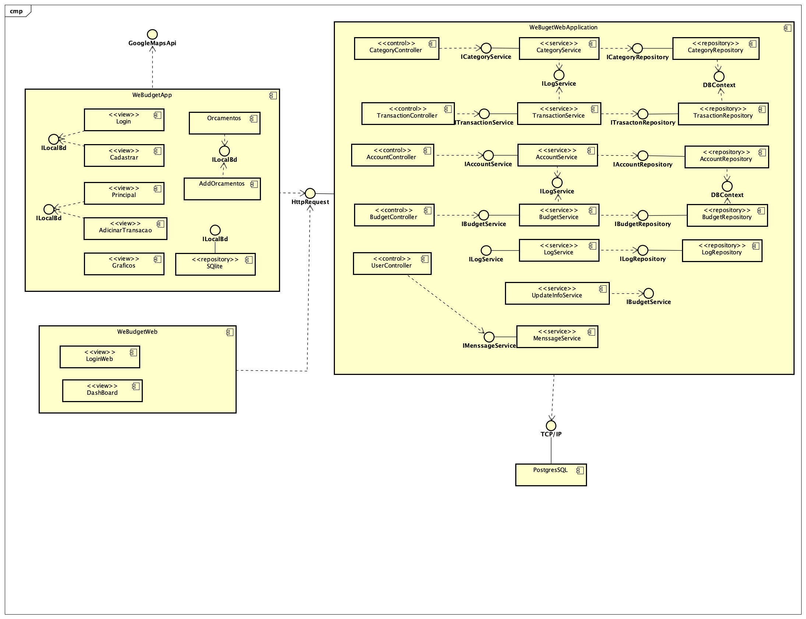

# WeBudget

**Helen Camila de Oliveira Andrade, hcoandrade@sga.pucminas.br**

**Izabella de Castro Lucas, iclucas@sga.pucminas.br**

**Nataniel Geraldo Mendes Peixoto, nataniel.peixoto@sga.pucminas.br**

**Pedro Campos Miranda, pcmiranda@sga.pucminas.br**

**Pedro Henrique Gonçalves Barcelos, 1265406@sga.pucminas.br**

---

Professores:

**Cleiton Silva Tavares**

**José Laerte Pires Xavier Junior**

---

_Curso de Engenharia de Software, Unidade Praça da Liberdade_

_Instituto de Informática e Ciências Exatas – Pontifícia Universidade de Minas Gerais (PUC MINAS), Belo Horizonte – MG – Brasil_

---

_**Resumo**. Escrever aqui o resumo. O resumo deve contextualizar rapidamente o trabalho, descrever seu objetivo e, ao final, 
mostrar algum resultado relevante do trabalho (até 10 linhas)._

---

## Histórico de Revisões

| **Data** | **Autor** | **Descrição** | **Versão** |
| --- | --- | --- | --- |
| **[31/08/2022]** | [Helen] | [Estruturação inicial da Apresentação e Requisitos do projeto] | [1.0.0] |
| **[14/09/2022]** | [Helen] | [Correções da Apresentação e Requisitos do projeto] | [2.0.0] |
| **[17/09/2022]** | [Izabella] | [Estruturação inicial da modelagem e projeto arquitetural] | [2.1.0] |

## SUMÁRIO

1. [Apresentação](#apresentacao "Apresentação")  
	1.1. Problema  
	1.2. Objetivos do trabalho  
	1.3. Definições e Abreviaturas  

2. [Requisitos](#requisitos "Requisitos")  
	2.1. Requisitos Funcionais  
	2.2. Requisitos Não-Funcionais  
	2.3. Restrições Arquiteturais  
	2.4. Mecanismos Arquiteturais  

3. [Modelagem](#modelagem "Modelagem e projeto arquitetural")  
	3.1. Visão de Negócio  
	3.2. Visão Lógica  
	3.3. Modelo de dados (opcional)  

4. [Avaliação](#avaliacao "Avaliação da Arquitetura")  
	4.1. Cenários  
	4.2. Avaliação  

5. [Referências](#referencias "REFERÊNCIAS") 

6. [Apêndices](#apendices "APÊNDICES") 

# 1. Apresentação

Muitas vezes a tarefa de coordenar as finanças pessoais é deixada de lado no Brasil, entre os motivos de problemas financeiros e até psicológicos, o descontrole financeiro é mais comum que parece.

De acordo com pesquisas realizadas pelo SPC Brasil e pela Confederação Nacional de Dirigentes Lojistas (CNDL), "seis em cada 10 brasileiros (58%) admitem nunca, ou somente as vezes, dedicam a atividades de controle da vida financeira".(SOUZA, 2018)

Esse controle financeiro é essencial para ter uma qualidade de vida. E com o mundo cada vez mais tecnológico, o smartphone se torna um elemento imprescindível nessa busca.

A consulta de gastos, receitas e uma possível elaboração de um plano financeiro é restrito apenas ao extrato bancário, se tornando complexa e desorganizada. Diante desse contexto surge a necessidade de amparo que possam auxiliar de maneira prática as pessoas que buscam realizar o controle de suas próprias finanças.

## 1.1. Problema

Notícias que demonstram o descontrole financeiro presente na maior parte da população brasileira estão cada vez mais comuns, segundo o Mapa da Inadimplência da Serasa, "em junho de 2022 haviam mais de 68 milhões de pessoas endividadas no Brasil"(Serasa,2022). Esse endividamento traz vários problemas, não apenas financeiros, como também de qualidade de vida.

## 1.2. Objetivos do trabalho

Utilizando de conhecimentos adquiridos nas disciplinas do curso de Engenharia de Software, tais como levantamentos de requisitos e programação, foi proposto o desenvolvimento de uma solução para o auxílio no controle, organização e planejamento financeiro. O objetivo geral é desenvolver um aplicativo que auxilie o usuário na organização da sua vida financeira.

Os objetivos específicos do projeto são:

- Auxiliar o usuário no controle de metas de despesas, receitas e investimentos;
- Possibilitar o usuário a gestão de objetivos financeiros de curto, médio e longo prazo;
- Possibilitar o usuário salvar o local das compras realizadas com a utilização do GPS.

## 1.3. Definições e Abreviaturas

- ID: Identidade;
- API: Application Programming Interface (Interface de Programação de Aplicação);
- SPC: Serviço de Proteção ao Crédito;
- RF: Requisito Funcional;
- RNF: Requisito Não Funcional;
- HTML: Hypertext Markup Language;
- CSS: Cascading Style Sheet (Folha de Estilo em Cascatas);
- JS: Java Script.

# 2. Requisitos

Visando auxiliar a definir quais são as funcionalidades de maior prioridade de serem feitas antes e quais possuem um maior nível de complexidade de se desenvolver foram desenvolvidas as tabelas abaixo.

## 2.1. Requisitos Funcionais

| **ID** | **Descrição** | **Prioridade** |
| --- | --- | --- |
| RF001 | O usuário realiza login no sistema com email e senha. | Alta |
| RF002 | O usuário se cadastra no sistema, informando os dados de nome, email, senha e confirmação de senha. | Alta |
| RF003 | O usuário poderá alterar o cadastro do seu email e senha. | Média |
| RF004 | O usuário deverá visualizar no primeiro login do sistema as informações explicando as funcionalidades da aplicação. | Média |
| RF005 | O usuário será capaz de recuperar a senha utilizando o email. | Média |
| RF006 | O usuário visualiza uma página inicial com o total de receitas, despesas, saldo atual, situação financeira bem como as últimas transações. | Alta |
| RF007 | O usuário visualiza uma página com a relação de todas as movimentações financeiras de determinado mês selecionado. | Alta |
| RF008 | O usuário cadastra categorias de despesa informando nome e selecionando ícones previamente cadastrados | Alta |
| RF009 | O usuário cadastra metas mensais de orçamento informando categoria e valor. | Alta |
| RF010 | O usuário visualiza as metas cadastradas dos meses anteriores. | Alta |
| RF011 | O usuário será capaz de excluir e editar metas do mês vigente. | Alta |
| RF012 | O usuário cadastra transações financeiras informando categoria, nome, data, valor, forma de pagamento e localização. | Alta |
| RF013 | O usuário será capaz de editar e excluir as transações financeiras do mês corrente. | Alta |
| RF014 | O usuário pode informar o local da compra utilizando o GPS. | Alta |
| RF015 | O usuário visualiza um gráfico de rosca com as despesas separadas por categoria do mês selecionado. | Alta |
| RF016 | O usuário visualiza um gráfico de rosca com as receitas separadas por categoria do mês selecionado. | Alta |
| RF017 | O usuário visualiza um gráfico de linha com a evolução dos receitas do mês selecionado. | Alta |
| RF018 | O usuário visualiza um gráfico de barra com a evolução dos despesas do mês selecionado. | Alta |
| RF019 | O usuário visualiza uma tabela no aplicativo web com a relação das transações realizadas no mês. | Alta |

## 2.2. Requisitos Não-Funcionais

| **ID** | **Descrição** |
| --- | --- |
| RNF001 | O software deve ser compatível nas plataformas Android. |
| RNF002 | O sistema deve prover serviços no ambiente web e móvel. |
| RNF003 | O usuário deve estar autenticado. |
| RNF004 | O sistema deve responder as requisições em até 500 milissegundos. |
| RNF005 | O sistema deve ser aprovado em testes de integração. |
| RNF006 | A parte mobile deve ter persistencia de dados local. |
| RNF007 | O sistema deve estar disponível 98% do tempo. |

## 2.3. Restrições Arquiteturais

As restrições impostas ao projeto que afetam sua arquitetura são :

- O Front-end da versão web será desenvolvido em HTML, CSS e JS;
- O Front-end da versão mobile será desenvolvido em Flutter;
- Os requisitos do Back-end serão desenvolvidos em C#- Microsoft .Net Core;
- Para a persistência de dados deve ser utilizado o SQL Server;
- Será utilizada a Api do google Maps.

## 2.4. Mecanismos Arquiteturais

| **Análise** | **Design** | **Implementação** |
| --- | --- | --- |
| Persistência Web | Banco de dados relacional | SQL server |
| Persistência Mobile | Banco de dados relacional | SQLite |
| Apresentação | Front-end web | HTML, CSS e JS |
| Apresentação | Front-end mobile | Flutter |
| Negócio | Back-end | C# |
| Teste de Software | Framework | XUnit |
| Deploy | API | Azure |
| Integração | Rest | Heroku |

# 3. Modelagem e projeto arquitetural

**Figura 1 - Visão Geral da arquitetura de solução.**

No momento em que é realizado o acesso ao sistema, o cliente mobile irá receber a interface renderizada pelo Flutter e as informações armazenadas diretamente no SQLite através de uma requisição HTTP. Em contrapartida, o cliente web receberá a interface disponibilizada pelo HTML,CSS e JS por meio de uma requisição TCP/IP. 

A comunicação com o back-end é por meio de uma api RESTful programada em C#, testada por meio do framework XUnit.net e suas APIs armazenadas no Azure. Através do C#, a aplicação web realiza a conexão ao banco de dados SQL Server por meio do ORM. Todo o ambiente virtual será disponibilizado por meio do Azure.

## 3.1. Visão de Negócio (Funcionalidades)

1.O sistema deve possibilitar o login do usuário na aplicativo

2.O sistema deve possibilitar o cadastro do usuário na plataforma.

3.O sistema deve possibilitar ao usuário inserir suas receitas e despesas do mês.

4.O sistema deve possibilitar a visualização do balanço entre receita e despesas.

5.O sistema deve possibilitar o usuário navegar pelos meses antecessores e futuros para estar visualizando as informações da receita, despesas e balanço.

6.O sistema deve possibilitar ao usuário visualizar relatórios e gráficos da movimentação financeira mensal.

7.O sistema deve possibilitar o usuário a inserir e visualizar a localização da compra no mapa.

8.O sistema deve possibilitar ao usuário escolher a forma que a despesa foi feita (a vista, débito, crédito ou parcelado).

9.O sistema deve possibilitar ao usuário cadastrar metas de despesas (alimentação, vestuário, viagem, lazer,.....).

10.O sistema deve possibilitar ao usuário receber notificações de limite de despesa excedido.

11.O sistema deve possibilitar o usuário cadastrar investimentos realizados e metas (investimento em tesouro direto, meta para compra de um carro,...).

12.O sistema deve possibilitar a exclusão da conta caso o usuário deseje.

### Descrição resumida dos Casos de Uso / Histórias de Usuário

Casos de Uso:

#### UC01 –  Acessar o aplicativo

| **Descrição** | Eu como usuário quero realizar o cadastro e o login no aplicativo |
| --- | --- |
| **Atores** | Usuário |
| **Prioridade** | Alta |
| **Requisitos associados** | RF001 e RF002 |
| **Fluxo Principal** |Entrar no aplicativo, realizar cadastro e realizar login. |

#### UC02 – Acessar as minhas receitas, despesas e transações

| **Descrição** | Eu como usuário quero poder estar visualizando a minha receita, despesas e transações cadastradas recentemente |
| --- | --- |
| **Atores** | Usuário |
| **Prioridade** | Alta |
| **Requisitos associados** | RF004|
| **Fluxo Principal** | Entrar no aplicativo e acessar o menu|

#### UC03 – Editar cadastro

| **Descrição** | Eu como usuário quero poder editar o meu cadastro |
| --- | --- |
| **Atores** | Usuário |
| **Prioridade** | Média |
| **Requisitos associados** | RF003 |
| **Fluxo Principal** | Entrar no aplicativo, ir nas configurações e editar cadastro|

#### UC04 – Acessar todas as transações 

| **Descrição** | Eu como usuário quero poder visualizar todas as transações do mês|
| --- | --- |
| **Atores** | Usuário |
| **Prioridade** | Alta |
| **Requisitos associados** | RF005 |
| **Fluxo Principal** | Entrar no aplicativo e acessar transações|

#### UC05 – Cadastrar metas

| **Descrição** | Eu como usuário quero poder cadastrar metas de despesa por tipo|
| --- | --- |
| **Atores** | Usuário |
| **Prioridade** | Alta |
| **Requisitos associados** | RF006 |
| **Fluxo Principal** | Entrar no aplicativo, cadastrar conteúdo e inserir meta|

#### UC06 – Cadastrar despesas e receitas

| **Descrição** | Eu como usuário quero cadastrar minhas receitas e despesas|
| --- | --- |
| **Atores** | Usuário |
| **Prioridade** | Alta |
| **Requisitos associados** | RF007 e RF009 |
| **Fluxo Principal** | Entrar no aplicativo, cadastrar conteúdo e inserir despesas ou receitas|

#### UC07 – Acessar relatório

| **Descrição** | Eu como usuário quero acessar relatórios |
| --- | --- |
| **Atores** | Usuário |
| **Prioridade** | Média |
| **Requisitos associados** | RF010 e  RF012 |
| **Fluxo Principal** | Entrar no aplicativo e acessar os relatórios|

#### UC08 – Recebimento de notificação

| **Descrição** | Eu como usuário quero receber notificação quando bater o meu limite de despesa|
| --- | --- |
| **Atores** | Usuário |
| **Prioridade** | Média|
| **Requisitos associados** | RF011 |
| **Fluxo Principal** | Entrar no aplicativo, entrar em configurações e  habilitar o recebimento de notificações|

#### UC09 – Inserir localização de compra

| **Descrição** | Eu como usuário desejo poder inserir juntamente com o meu gasto a localização da despesa|
| --- | --- |
| **Atores** | Usuário |
| **Prioridade** |Alta|
| **Requisitos associados** | RF008 |
| **Fluxo Principal** | Entrar no aplicativo, cadastrar conteúdo, entrar em despesas ou receitas, selecionar opção despesa e inserir localização|

 Histórias de Usuário:

- Como pai de família quero conseguir cadastrar metas financeiras, para que eu possa estar comprando um carro futuramente.
- Como estagiário, quero poder analisar como está o fluxo de meu dinheiro, para que eu possa ter mais controle dos meus gastos.
- Como dona de uma loja de bolos, desejo saber a localização dos comércios em que comprei os produtos para fabricação dos bolos, a fim de que ao realizar o fechamento  das contas do mês eu consiga identificar mais rapidamente quais foram os gastos.
- Como noivo, precisa fazer um planejamento financeiro, para que consiga pagar o casório.

## 3.2. Visão Lógica

### Diagrama de Classes

### Diagrama de componentes

# 4. Avaliação da Arquitetura

_Esta seção descreve a avaliação da arquitetura apresentada, baseada no método ATAM._

## 4.1. Cenários

_Apresente os cenários de testes utilizados na realização dos testes da sua aplicação. Escolha cenários de testes que demonstrem os requisitos não funcionais sendo satisfeitos. Os requisitos a seguir são apenas exemplos de possíveis requisitos, devendo ser revistos, adequados a cada projeto e complementados de forma a terem uma especificação completa e auto-explicativa._

**Cenário 1 - Acessibilidade:** Suspendisse consequat consectetur velit. Sed sem risus, dictum dictum facilisis vitae, commodo quis leo. Vivamus nulla sem, cursus a mollis quis, interdum at nulla. Nullam dictum congue mauris. Praesent nec nisi hendrerit, ullamcorper tortor non, rutrum sem. In non lectus tortor. Nulla vel tincidunt eros.

**Cenário 2 - Interoperabilidade:** Pellentesque habitant morbi tristique senectus et netus et malesuada fames ac turpis egestas. Fusce ut accumsan erat. Pellentesque in enim tempus, iaculis sem in, semper arcu.

**Cenário 3 - Manutenibilidade:** Phasellus magna tellus, consectetur quis scelerisque eget, ultricies eu ligula. Sed rhoncus fermentum nisi, a ullamcorper leo fringilla id. Nulla lacinia sem vel magna ornare, non tincidunt ipsum rhoncus. Nam euismod semper ante id tristique. Mauris vel elit augue.

**Cenário 4 - Segurança:** Suspendisse consectetur porta tortor non convallis. Sed lobortis erat sed dignissim dignissim. Nunc eleifend elit et aliquet imperdiet. Ut eu quam at lacus tincidunt fringilla eget maximus metus. Praesent finibus, sapien eget molestie porta, neque turpis congue risus, vel porttitor sapien tortor ac nulla. Aliquam erat volutpat.

## 4.2. Avaliação

_Apresente as medidas registradas na coleta de dados. O que não for possível quantificar apresente uma justificativa baseada em evidências qualitativas que suportam o atendimento do requisito não-funcional. Apresente uma avaliação geral da arquitetura indicando os pontos fortes e as limitações da arquitetura proposta._

| **Atributo de Qualidade:** | Segurança |
| --- | --- |
| **Requisito de Qualidade** | Acesso aos recursos restritos deve ser controlado |
| **Preocupação:** | Os acessos de usuários devem ser controlados de forma que cada um tenha acesso apenas aos recursos condizentes as suas credenciais. |
| **Cenários(s):** | Cenário 4 |
| **Ambiente:** | Sistema em operação normal |
| **Estímulo:** | Acesso do administrador do sistema as funcionalidades de cadastro de novos produtos e exclusão de produtos. |
| **Mecanismo:** | O servidor de aplicação (Rails) gera um _token_ de acesso para o usuário que se autentica no sistema. Este _token_ é transferido para a camada de visualização (Angular) após a autenticação e o tratamento visual das funcionalidades podem ser tratados neste nível. |
| **Medida de Resposta:** | As áreas restritas do sistema devem ser disponibilizadas apenas quando há o acesso de usuários credenciados. |

**Considerações sobre a arquitetura:**

| **Riscos:** | Não existe |
| --- | --- |
| **Pontos de Sensibilidade:** | Não existe |
| _ **Tradeoff** _ **:** | Não existe |

Evidências dos testes realizados

_Apresente imagens, descreva os testes de tal forma que se comprove a realização da avaliação._

# 5. REFERÊNCIAS

**[1]** - _SOUZA, Ludmila. **Pesquisa revela que 58% dos brasileiros não se dedicam às próprias finanças**. São Paulo, c2018._

**[2]** - _SERASA. **Mapa da inadimplência e renegociação de dívidas no Brasil**. c2022._

# 6. APÊNDICES

_Inclua o URL do repositório (Github, Bitbucket, etc) onde você armazenou o código da sua prova de conceito/protótipo arquitetural da aplicação como anexos. A inclusão da URL desse repositório de código servirá como base para garantir a autenticidade dos trabalhos._
